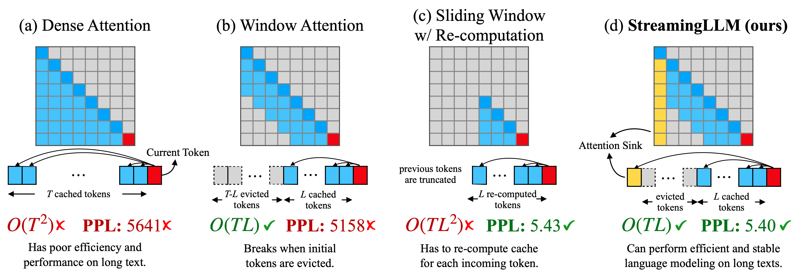

# Efficient Streaming Language Models with Attention Sinks 
[[paper](http://arxiv.org/abs/2309.17453)] [[slides](assets/StreamingLLM.pdf)][[video](https://youtu.be/hvJsEzP34o8)]



https://github.com/mit-han-lab/streaming-llm/assets/40906949/2bd1cda4-a0bd-47d1-a023-fbf7779b8358


## Abstract
Deploying Large Language Models (LLMs) in streaming applications such as multi-round dialogue, where long interactions are expected, is urgently needed but poses two major challenges. Firstly, during the decoding stage, caching previous tokens' Key and Value states (KV) consumes extensive memory. Secondly, popular LLMs cannot generalize to longer texts than the training sequence length. Window attention, where only the most recent KVs are cached, is a natural approach --- but we show that it fails when the text length surpasses the cache size. We observe an interesting phenomenon, namely attention sink, that keeping the KV of initial tokens will largely recover the performance of window attention. In this paper, we first demonstrate that the emergence of attention sink is due to the strong attention scores towards initial tokens as a ``sink'' even if they are not semantically important. Based on the above analysis, we introduce StreamingLLM, an efficient framework that enables LLMs trained with a finite length attention window to generalize to infinite sequence length without any fine-tuning. We show that StreamingLLM can enable Llama-2, MPT, Falcon, and Pythia to perform stable and efficient language modeling with up to 4 million tokens and more. In addition, we discover that adding a placeholder token as a dedicated attention sink during pre-training can further improve streaming deployment. In streaming settings, StreamingLLM outperforms the sliding window recomputation baseline by up to 22.2x speedup.

## Usage

### Environment Setup

```bash
conda create -yn mindnlp python=3.9
conda activate mindnlp

pip install mindnlp

python setup.py develop
```

### Run Streaming Llama Chatbot

```bash
python examples/run_streaming_llama.py  --enable_streaming
```

## Citation

If you find StreamingLLM useful or relevant to your project and research, please kindly cite our paper:

```bibtex
@article{xiao2023streamingllm,
        title={Efficient Streaming Language Models with Attention Sinks},
        author={Xiao, Guangxuan and Tian, Yuandong and Chen, Beidi and Han, Song and Lewis, Mike},
        journal={arXiv},
        year={2023}
        }
```
